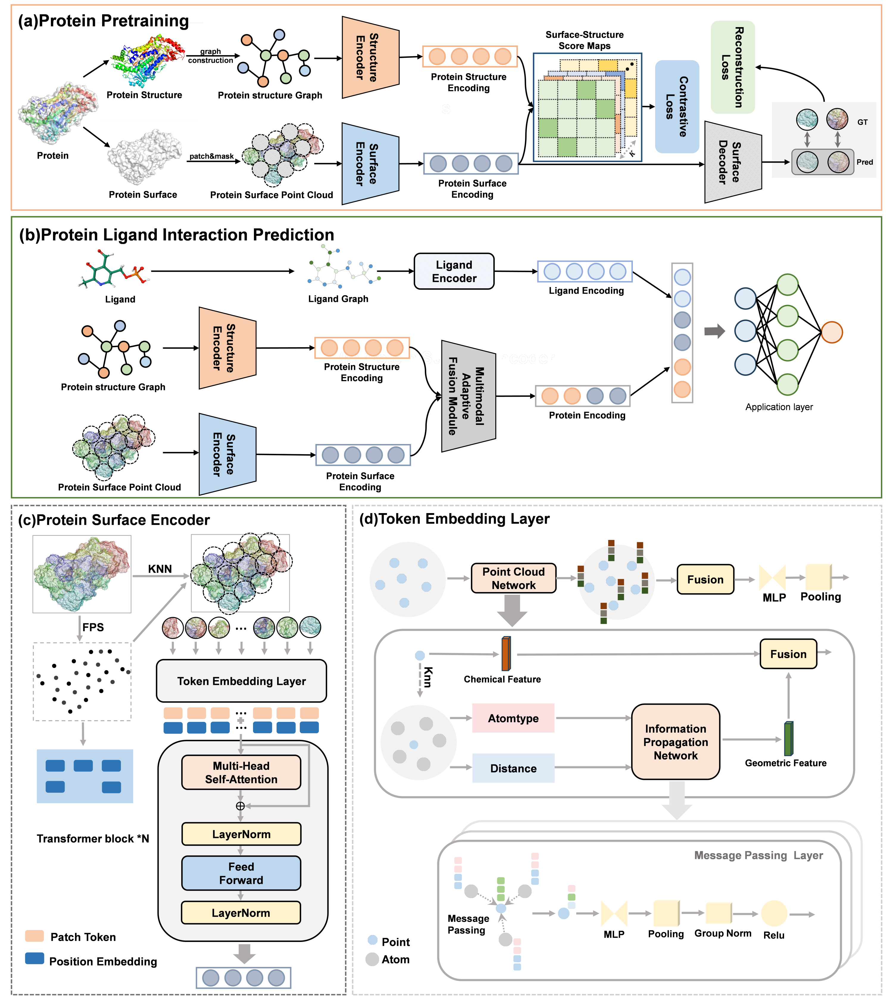

# PLiSAGE: A Multimodal Approach for Predicting Protein-Ligand Interactions via Surface and Geometry Embeddings  

**PLiSAGE** is an open-source framework for predicting protein-ligand interactions by integrating multimodal surface features and geometric structure encoding. This repository provides the complete implementation of the model and examples for downstream tasks.  
## Model Architecture




## Table of Contents  
- [Installation](#installation)  
- [Dataset Preparation](#dataset-preparation)  
- [Data Processing](#data-processing)  
- [Training & Inference](#training--inference)  
- [Citation](#citation)  


## <a name="installation"></a> Installation  
1. **Clone the Repository**  
   ```bash  
   git clone git@github.com:catly/PLiSAGE.git  
   cd PLiSAGE  
   ```  

2. **Create and Activate Conda Environment**  
   ```bash  
   conda env create -f environment.yaml  
   conda activate plisage  
   ```  


## <a name="dataset-preparation"></a> Dataset Preparation  
### Pretraining Data (SwissProt)  
1. Create the directory:  
   ```bash  
   mkdir -p data/pretrain_data/swissprot  
   ```  
2. Download the AlphaFold SwissProt dataset from [EBi FTP](https://ftp.ebi.ac.uk/pub/databases/alphafold/latest/swissprot_pdb_v4.tar).  
3. Move and extract the file:  
   ```bash  
   tar -xvf swissprot_pdb_v4.tar -C data/pretrain_data/swissprot  
   ```  

### Downstream Tasks Data  
Create directories for downstream task datasets:  
```bash  
mkdir -p downstreamtasks/data/downsteam_data/{PDBbind,DAVIS,KIBA,BindingDB}  
```  

#### Data Sources  
- **Binary Classification (DAVIS, BindingDB, BIOSNAP)**: Download from [MolTrans](https://github.com/kexinhuang12345/MolTrans/tree/master/dataset).  
- **Affinity Prediction (PDBbind v2020)**: Download from [PDBbind](http://pdbbind.org.cn/).  


## <a name="data-processing"></a> Data Processing  
### Pretraining Data Processing  
Convert raw data to the model input format:  
```bash  
python predata_process.py  
```  

### Downstream Tasks Data Processing  
Run the data processing script for the task (replace `{task_name}` with `pli` or `dti`):  
```bash  
python ./downstreamtasks/{task_name}/{task_name}_process.py  
```  


## <a name="training--inference"></a> Training & Inference  
### Pretraining  
Start pretraining:  
```bash  
python pre_train.py  
```  

### Downstream Tasks  
#### 1. Protein-Ligand Binding Affinity Prediction (PDBbind)  
Start prediction with pretrained weights:  
```bash  
python ./downstreamtasks/pli/pli.py --ckpt ./check_point/checkpoint.pth.tar  
```  

#### 2. Drug-Protein Binary Classification (DAVIS, BindingDB)  
```bash  
python ./downstreamtasks/dti/dti.py --ckpt ./check_point/checkpoint.pth.tar  
```  
